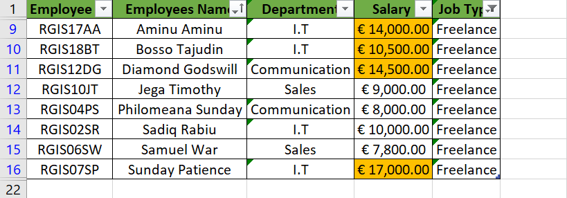
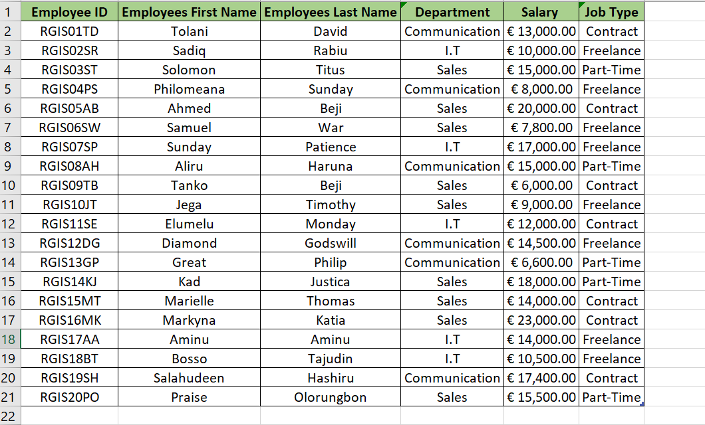
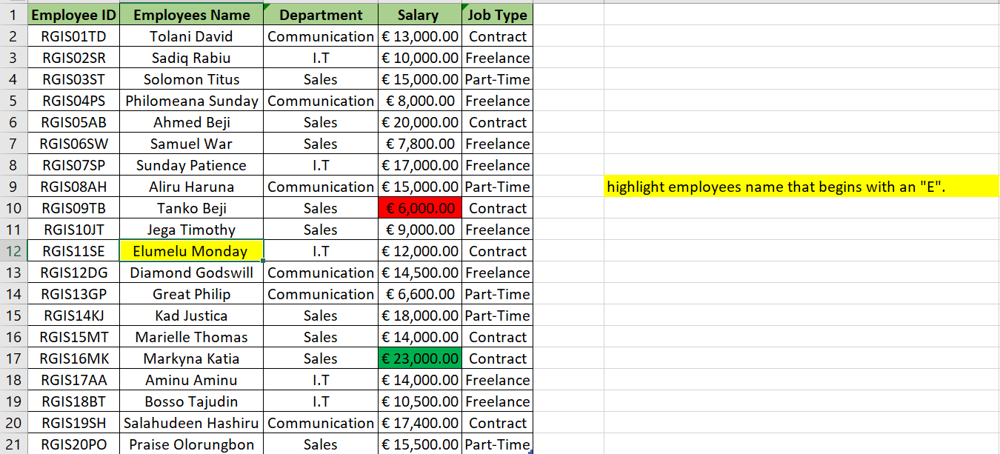
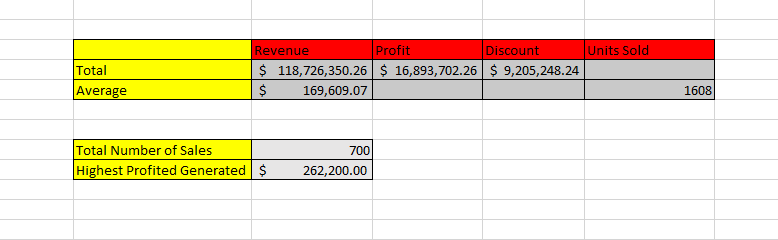

# CLASS_EXERCISE
A class exercise to showcase personal understanding to the basic concept and formula of Excel....

## Introduction

In this exercise, a hypothetical sales dataset will be analyzed to extract valuable insights. The dataset had been provided as part of our class tutorials, offering an opportunity to apply essential data analysis skills.

_**Disclaimer**_ ⚠️- _All data used for this analysis are hypothetical data generated and do not represent any company's data or an attempt to endanger their performance._

## Employee Details of "OTIzzz Company"-TASK_ONE
The task here inludes the the following:
1. Display employees who are freelancers earning salary above $10,0000.
2. Split employees full name into first name and last name and checking for duplicate data.
3. Highlight employees with "E" as initials and also highlighting the highest earner (Green) and the lowest earner (Red).

Task 1               |    Task 2              |   Task 3
:-------------------:|:----------------------:|:---------------:
          |             |  

## Problem Statement for TASK_TWO

The primary goal of the analysis is to extract valuable insights from the sales data, including the total revenue and profit, average revenue and units sold per order, total discounts given, total number of sales, and the highest profit generated. Additionally, a "Sales Range" column was created to categorize sales as 'High Sales' or 'Low Sales' based on predefined criteria.

## Skill and Concept Demonstrated:

The analysis had demonstrated a range of essential data analysis skills, such as:
- Data extraction
- Manipulation, and Visualization
### It had also showcased the application of statistical measures and conditional logic to make data-driven decisions.

## Visualization

The analysis had explored the total revenue, profit, average order metrics, total discounts, and had categorized sales as 'High Sales' or 'Low Sales.'. A photo is shown below and more details are include in the attached Excel files.

## Conclusions and Recommendations

Upon completing the analysis, meaningful conclusions will be drawn, and recommendations will be offered based on the findings. The insights can be utilized by businesses to optimize pricing strategies, identify profitable product lines, and understand the sales patterns that lead to higher profits

